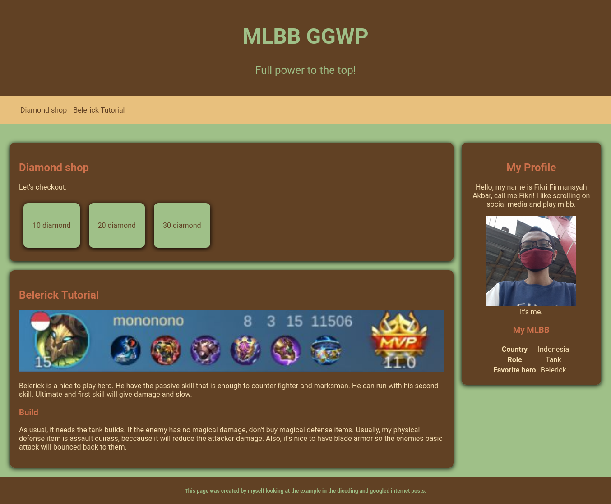
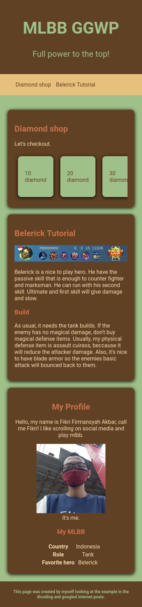

# MLBB GGWP Front End
This is an front-end exercise project written with plain semantic HTML, CSS, and JS. It takes the theme about mlbb: just belerick, because I like to use it. If you didn't know it, it is a moba game. This project is simple but quite challenging to me.
## Screenshots

Desktop view

Mobile view
